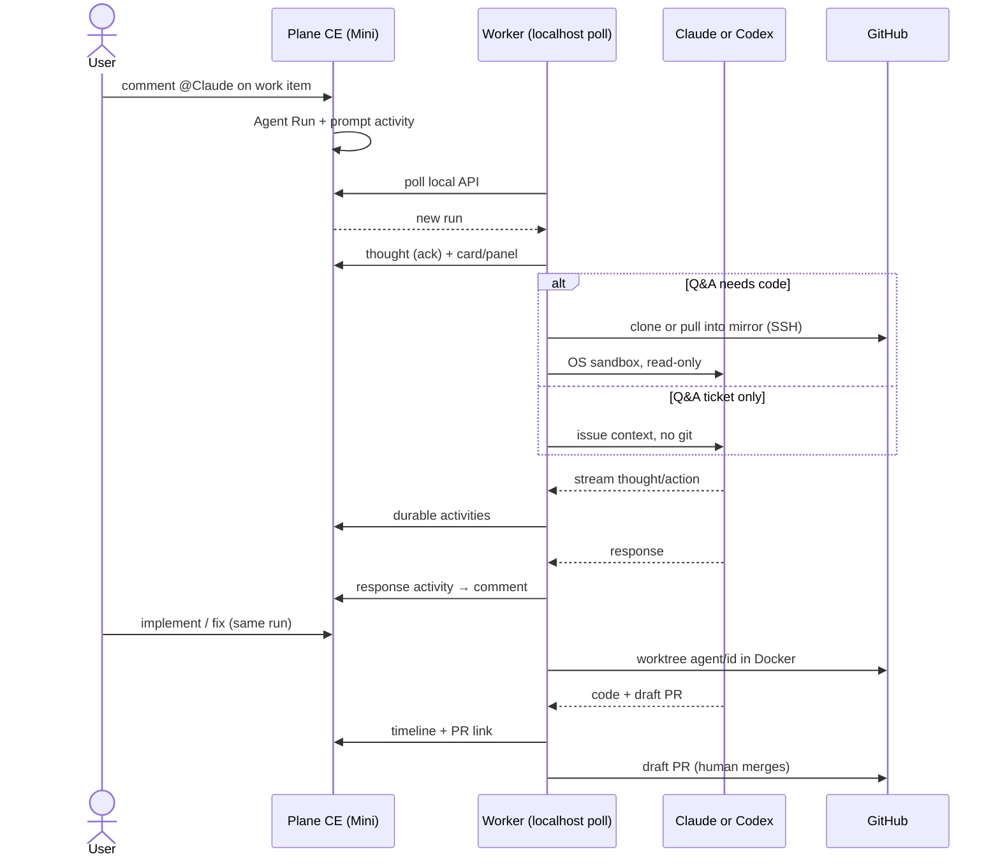
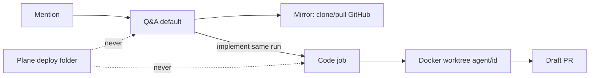

# Diagrams

## End-to-end (v1)

```mermaid
sequenceDiagram
  actor User
  participant Plane as Plane CE (Mini)
  participant Worker as Worker (localhost poll)
  participant CLI as Claude or Codex
  participant Git as GitHub

  User->>Plane: comment @Claude on work item
  Plane->>Plane: Agent Run + prompt activity
  Worker->>Plane: poll local API
  Plane-->>Worker: new run
  Worker->>Plane: thought (ack) + card/panel
  alt Q&A needs code
    Worker->>Git: clone or pull into mirror (SSH)
    Worker->>CLI: OS sandbox, read-only
  else Q&A ticket only
    Worker->>CLI: issue context, no git
  end
  CLI-->>Worker: stream thought/action
  Worker->>Plane: durable activities
  CLI-->>Worker: response
  Worker->>Plane: response activity → comment
  User->>Plane: implement / fix (same run)
  Worker->>Git: worktree agent/id in Docker
  CLI-->>Worker: code + draft PR
  Worker->>Plane: timeline + PR link
  Worker->>Git: draft PR (human merges)
```

## Trees

```mermaid
flowchart LR
  mention[Mention] --> qa[Q&A default]
  qa --> mirror[Mirror: clone/pull GitHub]
  qa -->|implement same run| code[Code job]
  code --> wt[Docker worktree agent/id]
  wt --> pr[Draft PR]
  deploy[Plane deploy folder] -.->|never| qa
  deploy -.->|never| code
```
